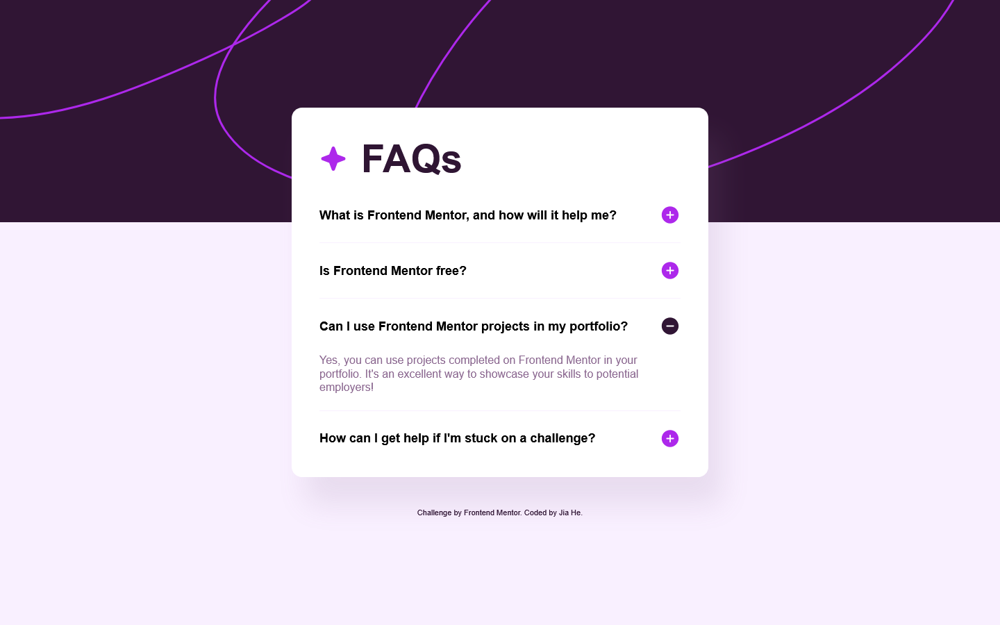
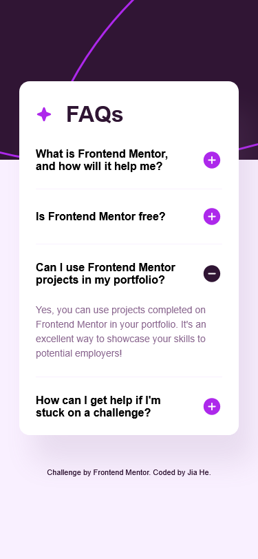

# Frontend Mentor - FAQ accordion solution

This is my solution to the [FAQ accordion challenge on Frontend Mentor](https://www.frontendmentor.io/challenges/faq-accordion-wyfFdeBwBz). Frontend Mentor challenges help you improve your coding skills by building realistic projects.

## Table of contents

- [Overview](#overview)
  - [The challenge](#the-challenge)
  - [Screenshot](#screenshot)
  - [Links](#links)
- [My process](#my-process)
  - [Built with](#built-with)
  - [What I learned](#what-i-learned)
  - [Continued development](#continued-development)
  - [Useful resources](#useful-resources)
- [Author](#author)

## Overview

### The challenge

Users should be able to:

- Hide/Show the answer to a question when the question is clicked
- Navigate the questions and hide/show answers using keyboard navigation alone
- View the optimal layout for the interface depending on their device's screen size
- See hover and focus states for all interactive elements on the page

### Screenshot




### Links

- Solution URL: [My solution]()
- Live Site URL: [Live site URL](https://faq-accordion-jiah.netlify.app/)

## My process

### Built with

- Semantic HTML5 markup
- CSS custom properties
- Flexbox

### What I learned

Throughout this project, I learned how to build an accessible accordion section for both screen readers and keyboard users. First, I used the hidden attribute to hide the panel content for all users. Then, with JavaScript, when I display the content with an animation using the show class, I remove the hidden attribute and update the aria-expanded state. This is very important for accessibility.

This is the correspond code:

```html
<div class="accordion">
  <h2 class="heading-secondary">
    <button
      id="accordion-button-01"
      aria-controls="accordion-panel-01"
      aria-expanded="false"
    >
      What is Frontend Mentor, and how will it help me?
      
    </button>
  </h2>
  <div
    role="region"
    id="accordion-panel-01"
    aria-labelledby="accordion-button-01"
    class="accordion-panel"
    hidden
  >
    <p>
      Frontend Mentor offers realistic coding challenges to help developers
      improve their frontend coding skills with projects in HTML, CSS, and
      JavaScript. It's suitable for all levels and ideal for portfolio building.
    </p>
  </div>
</div>
```

```js
if (!expanded) {
      this.setAttribute("aria-expanded", "true");
      panel.hidden = false;
      requestAnimationFrame(() => {
        panel.classList.add("show");
      });
```

### Continued development

In the future, I plan to enhance accessibility even further, ensuring the project is fully inclusive for all users.

### Useful resources

- [Tools and Techniques to Create Accessible Accordion Components](https://www.a11y-collective.com/blog/accessible-accordion/)
- [My favourite accessible accordion pattern](https://www.hassellinclusion.com/blog/accessible-accordion-pattern/)

## Author

- Frontend Mentor - [@JiaHe35354](https://www.frontendmentor.io/profile/JiaHe35354)
